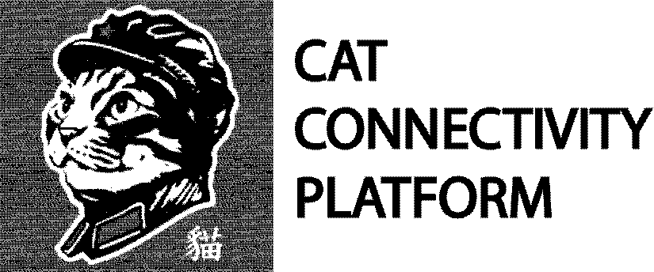

# Cat Connectivity Platform (Bus Arrival Dashboard)

_Part of a series of SmartHome (CCP) applications_

## Getting Started
You need:
1. Raspberry Pi Zero W 
2. Waveshare 7.5Inch Display (with HAT)

## Initial Setup
1. Follow the steps to create a headless RPI Zero instance [here](https://code.mendhak.com/prepare-raspberry-pi/)
2. Ensure that a static IP is setup for the headless instance (TIP: use `ssh-copy-id` for login-free access)
3. Obtain [LTA API key]()

## Installation
1. 

## Acknowledgements
Inspired from [@mendhaks epaper display project](https://github.com/mendhak/waveshare-epaper-display)